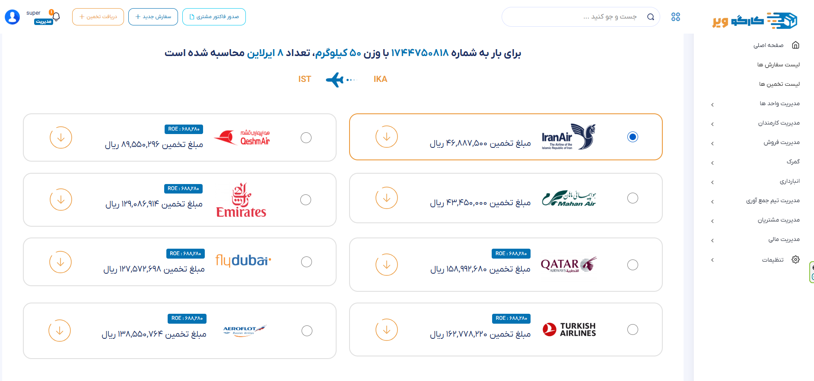

# ✈️ Cargoware
Cargoware is a logistics platform for `estimating shipping costs` based on `weight`, `size`, and `airlines`. It allows staff to `manage orders`, `generate invoices`, `airway bills`, `packing lists`, and handle `airline sales`, `agent tools`, and `collection tasks`.

## Available Sections :
- **Cost Estimation for Shipping**  
   This section allows users to estimate shipping costs based on package weight, dimensions, and available airlines.
  
> **Note :** Only `one section` of the project has been shared here.
>
> the process demonstrated in this project is initially handled by the `LoadsController` and then managed by the `EstimateController`.
> 
> for the Estimation section, it would have been better to implement a service using Strategy and Factory design patterns to enhance flexibility and scalability. Unfortunately, due to time constraints, this was not possible.

## Below are images that illustrate the visual flow of the process
| Quick Estimate Modal | Calculated Estimates | Continuation of the Process |
|-----------|-----------|-----------|
|  |  |  |
